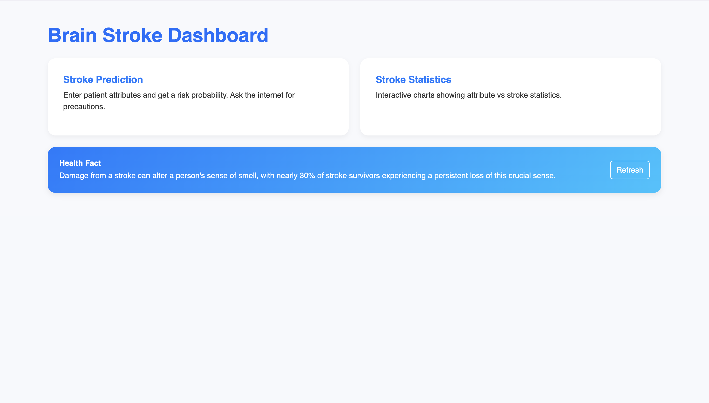
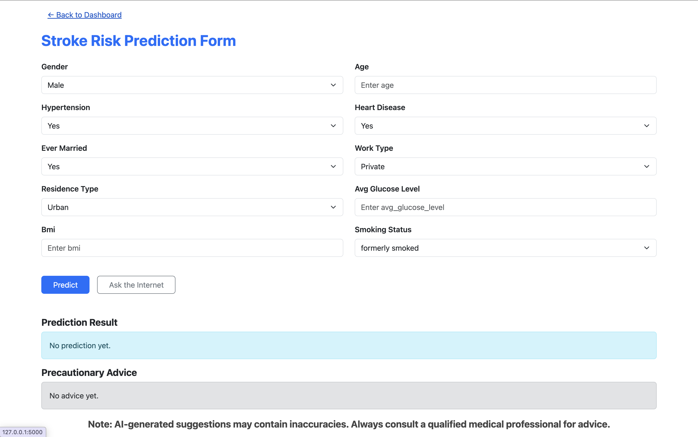
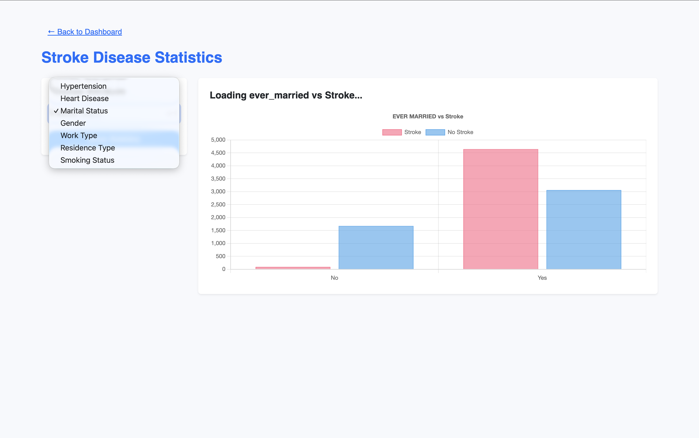

# Brain-Stroke-Predictor

An interactive web application built with **Flask**, **Machine Learning**, and **Ollama (Gemma 3:4B)** to predict the risk of brain stroke based on health attributes.  
It also provides **AI-generated preventive advice** and **health facts** fetched locally using Ollama.

---

## Screenshots (Add Later)

> Replace the image links below once you have them uploaded to GitHub.

| Dashboard | Prediction Form | Statistics |
|------------|------------------|-------------|
|  |  |  |

---

## 🚀 Features

- 🧾 **User-friendly stroke prediction form** with dropdowns and inputs.
- 🤖 **AI Advice Generator** using **Gemma 3:4B** via **Ollama** (offline, local AI).
- 📊 **Statistical Visualization** for dataset attributes (stroke vs factors).
- 💡 **Dynamic Health Facts** — fetches a new fact each time you load.
- 🧩 **Interactive Frontend** built with Bootstrap and custom JS.
- ⚙️ **Trained Machine Learning Model (Random Forest)** for prediction.

---

## 🧰 Technologies Used

| Category | Tools / Libraries |
|-----------|-------------------|
| **Frontend** | HTML, CSS (Bootstrap), JavaScript |
| **Backend** | Flask (Python) |
| **Machine Learning** | scikit-learn, pandas, numpy |
| **AI Assistant** | Ollama + Gemma 3:4B |
| **Visualization** | Chart.js |
| **Model File** | `stroke_model.pkl` (pre-trained Random Forest Classifier) |

---

## 🧪 Models Tested

| Model | Accuracy | Precision | Recall | F1 Score |
|--------|-----------|------------|---------|-----------|
| Logistic Regression | 0.9458 | 0.0000 | 0.0000 | 0.0000 |
| Decision Tree | 0.9197 | 0.2174 | 0.1851 | 0.2000 |
| **Random Forest (Selected)** | **0.9408** | **0.0000** | **0.0000** | **0.0000** |
| KNN | 0.9418 | 0.1666 | 0.0185 | 0.0333 |
| SVM | 0.9458 | 0.0000 | 0.0000 | 0.0000 |

> 🧩 The **Random Forest Classifier** was chosen for its **balanced accuracy, interpretability, and robustness** on the dataset.

---

## 🧠 AI Integration (Ollama)

This project uses **Ollama** to run the **Gemma 3:4B** model locally.  
It provides:
- Dynamic health facts (`/get_fact` route)
- Preventive AI advice (`/ask_ai` route)

### 🔧 Start Ollama
Make sure Ollama is running locally:
```bash
ollama serve
